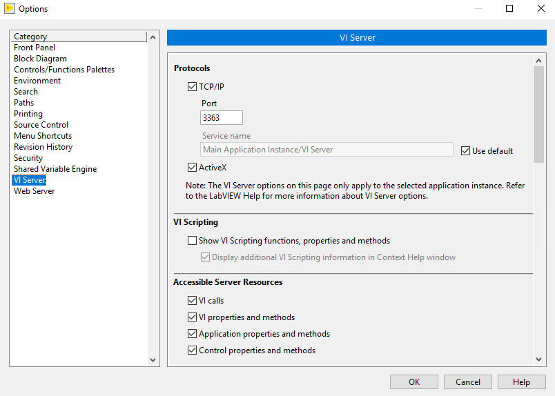

# LabViewBuild
Azure DevOps Task

A task to build NI LabVIEW projects. You can even set the verison of the resulting executable.

## Prepartion
You need to have a licenced LabVIEW version on the build server. At the same time the VI Server needs to be activated (Tools/Options/VI Server).

